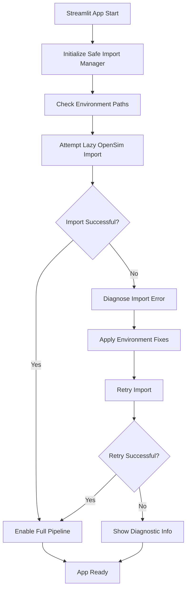

# Design Document

## Overview

The OpenSim integration fix addresses the critical DLL loading failure that prevents the Streamlit application from starting, even though OpenSim is properly installed and working (as evidenced by successful execution of `run_opensim_batch.py`). The issue appears to be related to import path conflicts or environment activation when running through Streamlit.

The solution implements a robust import system that handles the specific DLL loading issues while preserving full OpenSim functionality. Since OpenSim is confirmed working, the focus is on fixing the import mechanism rather than creating alternative processing paths.

## Architecture

### Core Components

1. **Safe Import Manager** - Handles OpenSim imports with proper error recovery and environment path fixes
2. **Environment Path Resolver** - Ensures correct Python environment and PATH variables for Streamlit context
3. **Import Isolation System** - Isolates OpenSim imports to prevent DLL conflicts with Streamlit
4. **Lazy Loading System** - Defers OpenSim imports until actually needed to avoid startup crashes
5. **Error Diagnostics** - Detailed error analysis to identify specific DLL or path issues

### System Flow



## Components and Interfaces

### 1. Safe Import Manager

**Purpose**: Handles OpenSim imports with proper error recovery and environment path fixes for Streamlit context.

**Interface**:
```python
class SafeImportManager:
    def lazy_import_opensim(self) -> Tuple[bool, Optional[object], Optional[Exception]]
    def fix_environment_paths(self) -> bool
    def diagnose_import_error(self, error: Exception) -> ImportDiagnostics
    def retry_with_fixes(self) -> bool
```

**Key Methods**:
- `lazy_import_opensim()`: Defers OpenSim import until needed, with proper error handling
- `fix_environment_paths()`: Adjusts PATH and environment variables for Streamlit context
- `diagnose_import_error()`: Analyzes specific DLL loading failures

### 2. Environment Path Resolver

**Purpose**: Ensures correct Python environment and PATH variables are set for Streamlit execution context.

**Interface**:
```python
class EnvironmentPathResolver:
    def detect_conda_environment(self) -> Optional[str]
    def fix_dll_paths(self) -> bool
    def add_opensim_to_path(self) -> bool
    def validate_environment_activation(self) -> bool
```

**Implementation Strategy**:
- Detect if running in conda environment vs system Python
- Add OpenSim DLL paths to system PATH
- Ensure proper environment variable inheritance in Streamlit

### 3. Import Isolation System

**Purpose**: Isolates OpenSim imports to prevent DLL conflicts with Streamlit and other packages.

**Interface**:
```python
class ImportIsolation:
    def create_isolated_import_context(self) -> ContextManager
    def preload_dependencies(self) -> bool
    def handle_dll_conflicts(self) -> bool
```

**Key Features**:
- Separate import context for OpenSim
- Preload critical DLLs before Streamlit initialization
- Handle conflicts between OpenSim and other scientific packages

### 4. Lazy Loading System

**Purpose**: Defers OpenSim imports until actually needed to avoid startup crashes.

**Interface**:
```python
class LazyOpenSimLoader:
    def get_opensim_module(self) -> object
    def is_loaded(self) -> bool
    def force_reload(self) -> bool
    def get_proxy_functions(self) -> Dict[str, Callable]
```

**Implementation**:
- Proxy pattern for OpenSim functions
- Load OpenSim only when specific functions are called
- Cache loaded modules for performance

### 5. Error Diagnostics

**Purpose**: Detailed error analysis to identify specific DLL or path issues.

**Interface**:
```python
class ErrorDiagnostics:
    def analyze_dll_error(self, error: Exception) -> DLLErrorReport
    def check_missing_dependencies(self) -> List[str]
    def generate_fix_script(self) -> str
    def test_opensim_functionality(self) -> TestResults
```

**Diagnostic Capabilities**:
- Identify missing Visual C++ redistributables
- Check for PATH configuration issues
- Detect conda environment activation problems
- Generate automated fix scripts

## Data Models

### OpenSim Status Model
```python
@dataclass
class OpenSimStatus:
    available: bool
    version: Optional[str]
    error: Optional[Exception]
    error_type: Optional[str]
    installation_complete: bool
    suggested_fixes: List[str]
```

### Validation Result Model
```python
@dataclass
class ValidationResult:
    valid: bool
    issues: List[ValidationIssue]
    warnings: List[str]
    fix_commands: List[str]
    
@dataclass
class ValidationIssue:
    component: str
    issue_type: str
    description: str
    severity: str
    fix_suggestion: str
```

### Processing Result Model
```python
@dataclass
class ProcessingResult:
    success: bool
    method_used: str  # "opensim", "alternative", "partial"
    output_files: List[str]
    warnings: List[str]
    errors: List[str]
    features_available: List[str]
```

## Error Handling

### Error Classification System

1. **DLL Loading Errors**
   - Missing Visual C++ Redistributables
   - Incorrect OpenSim installation
   - PATH configuration issues

2. **Version Compatibility Errors**
   - Python version mismatch
   - OpenSim version incompatibility
   - Package version conflicts

3. **Environment Errors**
   - Missing conda environment
   - Incorrect package installations
   - System configuration issues

### Error Response Strategy

```python
class ErrorHandler:
    def handle_dll_error(self, error: Exception) -> ErrorResponse
    def handle_version_error(self, error: Exception) -> ErrorResponse
    def handle_environment_error(self, error: Exception) -> ErrorResponse
    
    def get_user_friendly_message(self, error: Exception) -> str
    def get_technical_details(self, error: Exception) -> str
    def get_fix_instructions(self, error: Exception) -> List[str]
```

### Logging Strategy

- **Error Logs**: Detailed technical information for debugging
- **User Logs**: Simplified messages for end users
- **Installation Logs**: Step-by-step installation validation results
- **Performance Logs**: Processing method performance comparison

## Testing Strategy

### Unit Tests

1. **OpenSim Manager Tests**
   - Mock OpenSim import failures
   - Test error classification
   - Validate fix suggestions

2. **Feature Toggle Tests**
   - Test feature availability logic
   - Validate alternative feature mapping
   - Test dynamic feature updates

3. **Alternative Processing Tests**
   - Compare results with OpenSim when available
   - Test temporal feature extraction
   - Validate simplified kinematics

### Integration Tests

1. **End-to-End Pipeline Tests**
   - Test complete pipeline with OpenSim
   - Test complete pipeline without OpenSim
   - Test graceful degradation scenarios

2. **Environment Validation Tests**
   - Test on clean environments
   - Test with various OpenSim installation states
   - Test fix command generation

### User Acceptance Tests

1. **Error Scenario Tests**
   - Fresh installation without OpenSim
   - Corrupted OpenSim installation
   - Missing dependencies

2. **Recovery Tests**
   - Test installation guide effectiveness
   - Test automatic retry after fixes
   - Test feature restoration after OpenSim installation

## Implementation Phases

### Phase 1: Core Error Handling
- Implement SafeOpenSimImporter
- Create basic error classification
- Add graceful degradation to main application

### Phase 2: Environment Validation
- Implement EnvironmentValidator
- Create comprehensive validation checks
- Generate platform-specific fix commands

### Phase 3: Alternative Processing
- Implement simplified biomechanics pipeline
- Create temporal-only analysis path
- Add feature comparison capabilities

### Phase 4: User Experience Enhancement
- Implement installation guidance system
- Add automatic retry mechanisms
- Create comprehensive error reporting

## Security Considerations

- **Safe Command Execution**: Validate all system commands before execution
- **Path Validation**: Ensure all file paths are within expected directories
- **Input Sanitization**: Validate all user inputs and file uploads
- **Error Information**: Avoid exposing sensitive system information in error messages